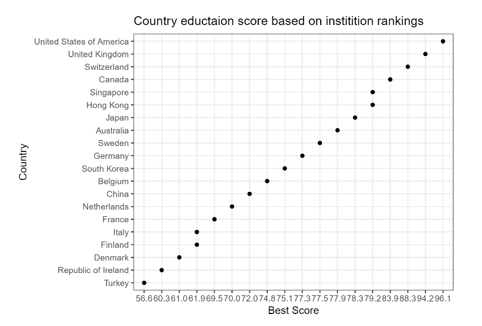

# Global University Ranking Analysis

**Author** : Akshi Chaudhary

**Latest Update** : December-02-2017

## Set up Project directories

* The cookie-cutter.sh in [src](https://github.com/akshi8/University_rankings/tree/master/src) can be used to create a basic project directory structure

* run the script in command-line as

      bash cookie-cutter.sh

## Data Download

* The data used for this analysis is from [Kaggle](https://www.kaggle.com/mylesoneill/world-university-rankings/data) and in order to download the data one can use the [kaggle_dat.sh](https://github.com/akshi8/University_rankings/blob/master/kaggle_dat.sh) file

* Be sure to be in the project directory before running the data download script, if you used the cookie-cutter.sh for creating repos

        bash kaggle_dat.sh

* Kaggle data download requires user to login with username and password, so after running the `kaggle_dat.sh` file you'll be required to enter your kaggle user name and password

* Also, note the above step will require you to sign up for kaggle if you're not a member

## About Data

* The project involves data in the form of csv, from three different University ranking sources
  - Times Higher ranking
  - Shanghai ranking
  - Center for World University Rankings

* There is data on country education expenditure as well

* The ranking given by all 3 sources is a lot of times very different, for example
  * `UBC` is ranked `34th in Times`, `37th in Shanghai` rankings and `67th` in CWRU rankings in world institution rankings

* All the ranking sources use different parameters to calculate total score of an institute and rank it accordingly

* Some of the common metrics for calculating score are :
  * international students
  * research
  * publications	income
  * num_students
  * student_staff_ratio
  * female_male_ratio
  * alumni job score

* The country-wise expenditure data contains the total expenditure on public and private institution based on elementary, higher education etc. over the years in billion dollars

## Questions:

To start with we can ask the following questions based on the data we have

1. Does `male-to-female` ratio of an institute influence it's ranking?
2.  Do countries who spend more on public institutions end up having more universities with higher rankings?
3.  What metrics influence the difference in university rankings among the 3 sources the most?

## Hypothesis:

For a preliminary analysis I will start with one question and hypothesize around it

1. Question 2
  * Null: Ratio of Expenditure on public institutions versus private institutions doesn't affect average institutions ranking of a country
  * Alternate : Average institutions ranking of a country who spends more on public institutions than private is higher

## Analysis Plan

* Find average expenditure between 1995 - 2011 of each country in public and private institutions (the expenditure is in billions)

* Get the best ranking institution in each country based on total score and rank them so that you can see which countries have the best institutes

* The score used for this analysis are from the `times Dataset`

* See the distributions of above Datasets
  * rendered pdf with plots [Initial_analysis.pdf](https://github.com/akshi8/University_rankings/tree/master/docs)
  * Best University score by each country

    

* Check the `RMD` notebook to follow through the steps : [Initial_analysis.Rmd](https://github.com/akshi8/University_rankings/tree/master/notebooks)

* Steps to be covered in next iterations of analysis

  * Get best_ranking and expenditures of each country by institution in one dataset
  * run a `ANOVA` on expenditure, best_ranking for groups public-private
  * Check the significance levels of hypothesis
  * Accept or reject Hypothesis
  * Publish results and visualizations

* After completing analysis of one question, start analysis of other questions
