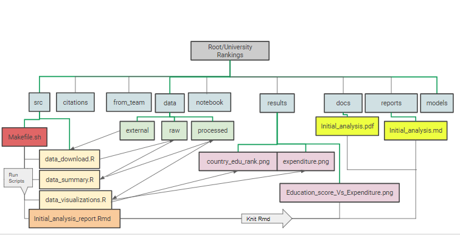
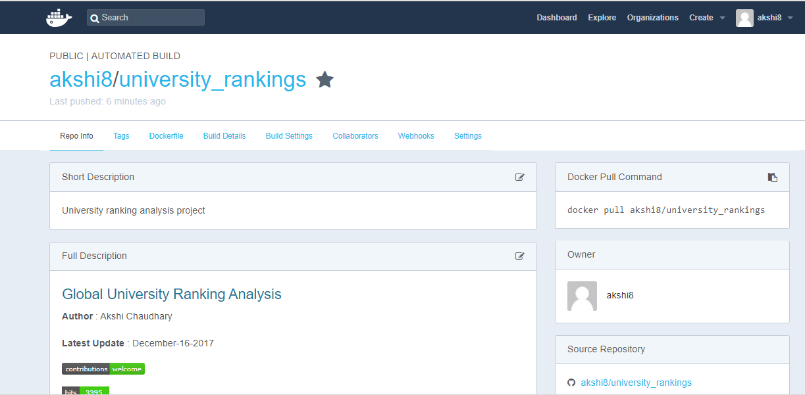

# Global University Ranking Analysis

**Author** : Akshi Chaudhary

**Latest Update** : December-16-2017

## About the project

Ranking universities is a difficult, political, and controversial practice. There are hundreds of different national and international university ranking systems, many of which disagree with each other.

For this project we will mainly use two data sources :

>  University ranking data

The Times Higher Education World University Ranking is widely regarded as one of the most influential and widely observed university measures. Founded in the United Kingdom in 2010, it has been criticized for its commercialization and for undermining non-English-instructing institutions.

> Education expenditure data

The second supplementary dataset contains information about public and private direct expenditure on education across nations. This data comes from the National Center for Education Statistics. It represents expenditure as a percentage of the gross domestic product.

## Question for initial analysis

Does spending more on education lead to better international university rankings?

## Hypothesis:

For a preliminary analysis, I will start with one question and hypothesize around it

  Null Hypothesis: Percent GDP expenditure on public education institutions doesn't affect higher education ranking of a country

  Alternate Hypothesis: Higher Percent GDP expenditure on public education institutions corresponds to higher education ranking of a country

## Data Download

* The data used for this analysis is from [Kaggle](https://www.kaggle.com/mylesoneill/world-university-rankings/data) and in order to download the data one can use the [kaggle_dat.sh](https://github.com/akshi8/University_rankings/blob/master/kaggle_dat.sh) file

* Kaggle data download requires user to login with username and password, so after running the `kaggle_dat.sh` the file you'll be required to enter your kaggle user name and password

> Also, note the above step will require you to sign up for kaggle if you're not a member

* Since many users may not be kaggle members, I have downloaded the data in the [external_data](https://github.com/akshi8/University_rankings/tree/master/data/external) repo for this project and this is a publicly accessible data

## Analysis Plan

* Create a driver script (**makefile/ Run_all**) for running the following crucial analysis steps

  - data download [data_download.R](https://github.com/akshi8/University_rankings/blob/master/src/data_download.R)
  - data cleaning and summary [data_summary.R](https://github.com/akshi8/University_rankings/blob/master/src/data_summary.R)
  - data visualization [data_visualizations.R](https://github.com/akshi8/University_rankings/blob/master/src/data_visualizations.R)

> Knitting R Markdown report having all the above steps and modelling results

  - data report in R markdown [Initial_analysis_Report.Rmd](https://github.com/akshi8/University_rankings/blob/master/reports/Initial_analysis_Report.rmd)
  - Rmd to be knit with `ezknitr::ezknit`

## Script Usage

### Method 1 : Makefile (Run_all) and `git clone`

> Clone this github repo by using the git clone command

        git clone https://github.com/akshi8/university_rankings.git

* This will a local copy of this repository

> Run all using Run_all.sh

* Make this project as your root directory

        cd university_rankings

* Running the following to clean directories and rebuild everything [Run_all.sh](https://github.com/akshi8/University_rankings/blob/master/src)

      
      bash Run_all.sh

>  The Run_all.sh will do the following things:

1. Download data from `external` data into `raw` data repo of using the [data_download.R](https://github.com/akshi8/University_rankings/blob/master/src/data_download.R) script

2. Take the raw data files named: `times.csv` and `expenditure.csv` and do the following using the [data_summary.R](https://github.com/akshi8/University_rankings/blob/master/src/data_summary.R) script
      - Missing value treatment
      - formatting datatypes
      - dropping unwanted variables
      - summarising data
      - output summarised datasets in [processed](https://github.com/akshi8/University_rankings/tree/master/data/processed) data repo as `rank.csv` and `school_exp.csv`
3. The processed data is used to plot data summaries in the form of visualizations using the [data_visualizations.R](https://github.com/akshi8/University_rankings/blob/master/src/data_visualizations.R)
      - Put all visualizations in results repo
      - figure on country education rankings [country_edu_rank](https://github.com/akshi8/University_rankings/blob/master/results/country_edu_rank.png)
      - figure of education expenditure across institutions types [expenditure.png](https://github.com/akshi8/University_rankings/blob/master/results/expenditure.png)

4. Knit R markdown file with linear model results and hypothesis testing using the [Initial_analysis_Report.Rmd](https://github.com/akshi8/University_rankings/blob/master/reports/Initial_analysis_Report.rmd)
    - save linear model figure to results [Education_score_Vs_Expenditure](https://github.com/akshi8/University_rankings/blob/master/results/Education_score_Vs_Expenditure.png)

* Clean the directories after the analysis using the MakeClean.sh

      bash MakeClean.sh
      
> Here is the data workflow diagram  for a quick look

### Method 2: Docker 

> **Docker installation is required**

* In the git-bash/ command line / Powershell type the following to pull the docker image from docker hub

      docker pull akshi8/university_rankings

* Run the Docker image and link it to your local university_rankings repo
* Enter `complete local directory path`

      docker run -it --rm -v c/.../local_directory_of_university_ranking/:/university_rankings akshi8/university_rankings:latest
* You will enter the `root` of the docker image
* First clean existing datasets
* Then run the analysis

     
      bash Run_all.sh
 
 * Clean directories
  
        bash MakeClean.sh
      
> The docker image for this project looks like this: 

## Analysis reports

* The analysis report in the form of R markdown file has been knitted to PDF and .md
* The report explains the whole analysis structure through code chunks and plots

See the rendered output in the `reports` and `docs` repo
[Initial_analysis_Report.md](https://github.com/akshi8/University_rankings/blob/master/reports/Initial_analysis_Report.md) , [Initial_analysis.PDF](https://github.com/akshi8/University_rankings/tree/master/docs)

## Hypothesis testing and figures

* The following plot shows that `higher education expenditures` best explain the high scores in country education rankings

    

* The p-value for higher education expenditure versus the education score is on the margin of significance level i.e. 0.056 (0.05 is the significance level), so it does not provide a very concrete evidence to reject the null hypothesis

* This could possibly mean while public expenditure is important for good higher education ranking of a country, it is not the only variable to explain it

## Future analysis

#### Other Ranking metrics

* All the ranking sources use different parameters to calculate total score of an institute and rank it accordingly

* Some of the common metrics used for calculating score are :
  * international students
  * research
  * publications  
  * num_students
  * student_staff_ratio
  * female_male_ratio
  * alumni job score

Some other hypothesis/ questions that I will be working on are :
#### Questions:

1. Does `male-to-female` ratio of an institute influence its ranking?
2. Does the amount of `research activity` affect university ranking?
